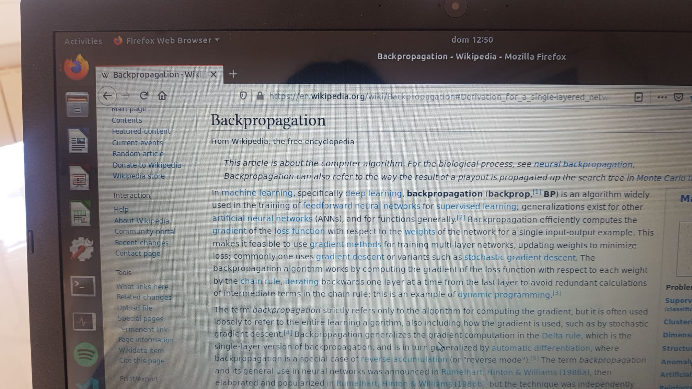

# SyntaxColor
## Llista de tasques a fer
 - [x] Fitxer ```*.txt``` amb 10 mil link a la Wikipedia (com a mínim)
 - [x] Fitxer ```*.txt``` amb 50 mil link a la Wikipedia (com a mínim)
 - [ ] 10 mil fitxers ```*.txt``` amb  el codi html del article (com ```NomDelArticle_X.txt```)
 - [ ] 10 mil fitxers ```*.csv``` amb _vectr=(paraula,tipus, ... , paraula,tipus)_ (com ```NomDelArticle_Y.cvs```)

## Historial de treball (El més recent adalt)
### 11/03/2020
1. El dataset amb els noms en angles ja està però de passar al document genera conflicte error cada 3 segons, he trobat 15 errors diferents.No és trivial solucionar-ho. Però podem funcionar amb molts errors:
 ```bash
 for i in {1..200}; do python3 scraping_names_of_articles_simple_version.py ; done
 ```
2. També està en proces un dataset en catlà perquè tinc curiositat en veure com és defensa la IA en un idioma que no em requereix consultar constantment el traductor per veure si la frase realment tè sentit o no. Aquest el fare directe tot i ja tenir el dataset amb noms. Fara un arxiu .txt on anairà enganxant el contingut dels articles que vagi agafant consecutibament amb `write()`

3. Ensenyar les fotos de Nitzsche en la 40 generació. 
### 10/03/2020
1. Necesites una funció que rebi un número i et retorni un document codificat en tensors de nombres reals. 
**Fet entenc que això esta estandaritzat i se'n diu hot-one encoding**

2. Un cop tinguis aquesta funció/classe faras una petita xarxa amb l arquitectura que creguis convenient que anira rebent N lletres i haurà de predir la N+1.
    * **Exemple amb Keras encara em queda editar el codi per guardar els pesos, però va prou bé**[Así hablo Zaratrusta][https://keras.io/examples/lstm_text_generation/]
    * **No he fet servir Tenserflow perquè:** `'Tensor' object has no attribute 'numpy'`veure més detalls en[https://github.com/tensorflow/tensorflow/issues/27519], tot i que en collab tira com la conexio no és massa bona  m'he decantat per: 
    
notes:
    * Queda pendent llegir [https://colah.github.io/posts/2015-08-Understanding-LSTMs/] o 
    [https://translate.google.com/translate?hl=es&sl=auto&tl=es&u=https%3A%2F%2Fcolah.github.io%2Fposts%2F2015-08-Understanding-LSTMs%2F]
### 02/03/2020 i 04/03/2020
T ho passo per aquí:

**Fer parlar el trasto**

La idea seria dividir la tasca en varios troços.

1. Necesites una funció que rebi un número i et retorni un document codificat en tensors de nombres reals.

2. Un cop tinguis aquesta funció/classe faras una petita xarxa amb l arquitectura que creguis convenient que anira rebent N lletres i haurà de predir la N+1.

3. Un cop aquesta xarxa es defengui parlant podem cambiar l entrenament a un entrenament adversari.

4. Quan vagi prou bé comencem afegint lo del color

(Mirar foto Codi)
   
### 24/02/2020
* El problema de `ls` que imprimeix els arxius amb `""` o amb `''` és perquè contenen o bé espais, o bé algun caràcter que internament se li han de ficar cometes per a que el _Sistema_ no confongui el String amb el nom amb algun altre orde, potser algun caràcter reservat. En tot cas no ha de ser problema i en cas de ser-lo hi ha una _idea_ de com solucionar-ho.

* El objectiu inicial és modifica lleugerament. L'objectiu actual, és elaborar  una IA tal que  _que aprengui a parlar lletra a lletra_. Programa primerament un codi (modul) que permeti passar un text (per exemple un dels arxius del tipus `NomDelArticle_X.txt`), lletra a lletra, a una llista (Recordar nombre<vector<matriu<"tensor"). Més que lletra hauria de ser caràcter a caràcter. Per exemple decidir si `ASCII` o `UTF-8`.  Per començar 5 lletres  (caràcters !)|-->  5 vectors. Fer-ho en paral·lel més endavant. Un com fet això entrenar la IA amb el dataset. Anirà ficant paraules  "a boleo" fins que trobi una estructura a "com escriu la Wikipedia".

* Un objectiu que és manté és augmentar el cardinal del directori `article_like_text_X` fins a `10^5`. (Ja s'ha confirmat que el estil del que hi ha és correcte.)

~~(P.D: Gener i Febrer examens grau.)~~
### 04/01/2020 
* Elimino la redundància dels arxius `*.dat`,
 ,és  a dir, `https://en.wikipedia.org/wiki/Hessian_matrix`, passa a ser: `Hessian_matrix` amb `redundanceDelate.py`.

* Els aproximadament 50 mil (potser ni ha de repetits per això n'hi ha 55 ) noms d'articles és troben a el subdirectori `./SyntaxColor/data_articles`on a cada arxiu `*.dat` n'hi ha mil noms d'articles del la Wikipedia (en).

* En els subdirectori `./SyntaxColor/article_like_text_X` hi ha alguns exemples dels fitxers `*.txt` que és volen extreure però en molts articles dóna error. El arxiu `articles_like_text.py`  a vegades funciona i a vegades no. No he trobat solució encara.

* Si fem `ls` en el directori dels poc articles fets per alguna raó alguns surten amb  cometes dobles o comentes.

```
"2010_IAAF_World_Indoor_Championships_–_Women's_long_jump_X.txt"
 Adam_Hammill_X.txt
 articles_like_text.py
'Degree_(music)_X.txt'
'Frank_McLaughlin_(artist)_X.txt'
 F_type_Adelaide_tram_X.txt
 Gotta_Learn_to_Love_Without_You_X.txt
 Hassayampa_River_Preserve_X.txt
 Joe_Davis_X.txt
'Kanwaljit_Singh_(politician)_X.txt'
 Madureira_X.txt
 Maine_State_Route_138_X.txt
 Mission_creep_X.txt
 Nosocomiicoccus_X.txt
 Periodon_X.txt
 Peter_Dutton_X.txt
 Princess_Yan_X.txt
 Prohibitory_Act_X.txt
'Seraphine_(company)_X.txt'
 The_Indiana_Theater_X.txt
 Thibaud_X.txt
 url1000_000.dat
 Washimiya,_Saitama_X.txt
'Yuki_Okada_(footballer,_born_1983)_X.txt'
 Zethalia_zelandica_X.txt

```
* **En resum:** encara queden per fer els fitxers `*.txt` i els `*.csv`. 

### 31/12/2019

``` python
import pyfiglet
 ...
 print pyfiglet.figlet_format("Hola!", font="big")
 ...
 
```
```
     _                                 
  /\| |/\                              
  \ ` ' /                              
 |_     _|                             
  / , . \                              
  \/|_|\/                              
 |  _ \                                
 | |_) | ___  _ __   __ _              
 |  _ < / _ \| '_ \ / _` |             
 | |_) | (_) | | | | (_| |             
 |____/ \___/|_| |_|\__,_|     _       
            | |               | |      
   ___ _ __ | |_ _ __ __ _  __| | __ _ 
  / _ \ '_ \| __| '__/ _` |/ _` |/ _` |
 |  __/ | | | |_| | | (_| | (_| | (_| |
  \___|_| |_|\__|_|  \__,_|\__,_|\__,_|
  (_)                                  
   _                                   
  | |            _   _     _           
  | |           | | (_)   | |          
  |_|  ___  _ __| |_ _  __| | __ _     
 / __|/ _ \| '__| __| |/ _` |/ _` |    
 \__ \ (_) | |  | |_| | (_| | (_| |    
 |___/\___/|_|   \__|_|\__,_|\__,_|    
     | ( )   /\                        
   __| |/   /  \   _ __  _   _         
  / _` |   / /\ \ | '_ \| | | |        
 | (_| |  / ____ \| | | | |_| |        
  \__,_| /_/    \_\_| |_|\__, |        
                          __/ |        
              _      _  _|___/         
     /\      | |    (_) \_\            
    /  \   __| |_ __ _  __ _           
   / /\ \ / _` | '__| |/ _` |          
  / ____ \ (_| | |  | | (_| |          
 /_/ _  \_\__,_|_|  |_|\__,_|          
  /\| |/\                              
  \ ` ' /                              
 |_     _|                             
  / , . \                              
  \/|_|\/  

```
### 19/12/2019
commit: In this picture you can see a pseudo code to extract html as csv file. 


### 18/12/2019

* Enllesteixo el codi que fa el _scraping_ del html  i converteix a _like text_
* Però faig una cutrada, em trobo amb el següent error:

``` bash
Traceback (most recent call last):
  File "aguacate.py", line 21, in <module>
    fEscriure=open("./html_like_text_X/"+str(nom)+"_X.txt",mode = 'w')
IOError: [Errno 2] No such file or directory: "./html_like_text_X/Ribera_Baja'/'Erribera_Beitia_X.txt"

```
la solució _cutre_:  
``` python 
     ...
     html=html.split("\n")[0]
     nom=html.replace("https://en.wikipedia.org/wiki/","")
     nom=nom.replace("/","\\") 
     ...
```
+ Preguntes per Adrià:
 * Com fico un comptador als ``` scryps ``` de python fàcil ?
 * Consell per executar en més d'un fil, per accelerar el procés ?
 * si faig ``` ls ``` , alguns arxius surten amb _' '_, altres amb _" "_ i altres normal:
 
 ``` bash
 'Sefer_haYashar_(midrash)_X.txt'
 Seh_Ran_Bala_X.txt
 Self-Portrait_as_the_Allegory_of_Painting_X.txt
 Senad_Jarović_X.txt
 Sergej_Kozlík_X.txt
 Seth_Firkins_X.txt
'Sex,_Life_&_Love_X.txt'
 Shimamoto_X.txt
 Shorncliffe_railway_station_X.txt
 Sierra_Norte_de_Sevilla_X.txt
'Silver_Lake_(Clinton_County,_New_York)_X.txt'
 Simhallsbadet,_Malmö_X.txt
 Sıracevizler,_Amasya_X.txt
 Situationist_Comedy_X.txt
 Slavko_Duščak_X.txt
 Småvatna_Hydroelectric_Power_Station_X.txt
 Smith_Memorial_Student_Union_X.txt
 Snow_Time_X.txt
 Snowy-cheeked_laughingthrush_X.txt
 Social_fund_X.txt
 Solar_Settlement_at_Schlierberg_X.txt
 Solombala_Shipyard_X.txt
 Someday_Soon_X.txt
 Sonita_Sutherland_X.txt
'Soul_Song_(disambiguation)_X.txt'
 Spatangidae_X.txt
 Speed_ring_X.txt
 Spirit_of_Indiana_X.txt
'Spunk_(play)_X.txt'
 SS_Tum_Tum_X.txt
'Stadium_(software)_X.txt'
'Stan_Wilson_(footballer,_born_1928)_X.txt'
 Stefan_Czarnowski_X.txt
 Stella_Kunkat_X.txt
 Stephen_A._Rudd_X.txt
'Steve_Marshall_(politician)_X.txt'
 Stonyx_clelia_X.txt
'Stowaway_(disambiguation)_X.txt'
"St_Paul's_Roman_Catholic_Academy_X.txt"

 ```
### 16/12/2019
* Baralla amb dependències i altres coses que no recordo.

### 12/12/2019
Finalment la cosa ha sigut bastant més fàcil. Els codis que circulen per stackoverflow han sigut una mala inversió amb, cada vegada un codi més complicat i un munt de ```python expect ``` n'he pogut treure 100, però era molt poc eficient ja que tots els _links_ de Wikipedia (en version) comencen amb ```url  https://en.wikipedia.org/wiki/NomDelArticle``` nomes cal buscar el nom amb el mètode ```pyhton wikipedia.random(1) ```  i després amb```python .replace(" ", "_")``` reemplaça els espais per guions baixos i tenim el nombre del article sense necessitat de  _recomprovar_ la seva existència amb els possible errors

```python
import wikipedia
...
 except wikipedia.exceptions.PageError as eP:
...
 except wikipedia.exceptions.DisambiguationError as eD:
...
```

Al directori ``` ./data_URLS ``` hi ha els primers 10 mil links. Potser hi ha de repetits però no és cap problema ja que després podran ser quantificats. Pujem la xifra a 50k de necessaris.

El codi que fa això és ``` nocalurl.py``` el nom  és en motiu de la pifia.

### 01/12/2019

Estic mirant aquest vídeo [Aquí enllaç](https://youtu.be/ng2o98k983k)

Execute comands in terminal 
```c
pip install beautifulsoup4
//No sè si hi ha alguna vesió superior, s ha instalat bé

pip install lxml
//També s'ha instalat bé (Ni idea que és)

pip install html5lib
//Aquest deu ser actual i obviament una llibreria de html

pip install requests
//No sé que és però aquest també l'ha passat l'Adrià.

// Als 5:20 min comença a explicar una mica que és HTML5 estructura i etiquetes
// Diu que és similar al metalleguatge XML
//S'obren els tag's i es tanquen els tag's
```

3:36 hores

[Stackoverflow](https://stackoverflow.com/questions/52690994/web-scraping-python-writing-to-a-csv)

```python
import requests
import csv
from bs4 import BeautifulSoup as bs

url = requests.get("https://www.top500.org/list/2018/06")
soup = bs(url.content, 'html.parser')

filename = "computerRank10.csv"
csv_writer = csv.writer(open(filename, 'w'))


for tr in soup.find_all("tr"):
    data = []
    # for headers ( entered only once - the first time - )
    for th in tr.find_all("th"):
        data.append(th.text)
    if data:
        print("Inserting headers : {}".format(','.join(data)))
        csv_writer.writerow(data)
        continue

    for td in tr.find_all("td"):
        if td.a:
            data.append(td.a.text.strip())
        else:
            data.append(td.text.strip())
    if data:
        print("Inserting data: {}".format(','.join(data)))
        csv_writer.writerow(data)
```
### 24/11/2019
* El que et comentava era algo tipus això, la wikipedia té diguem 4 clases de contingut, en negreta en blau per les referencies, formules i text normal



* Extreure el codi html es senzill i hi han moduls de python que tel parsejen;


~~Bones Adrià, vale ja miraré quin paquet haig de importar per fer-ho. Però aleshores de conjunts {X,Y} com a dataset que faig servir. La Wikipedia mateixa ?~~

* X: El text tal qual, sense labels
  Y: Vector de (Paraula,Tipus, paraula,tipus,paraula,tipus)

* Aleshores agafes dela wikipedia els articles i prepares per cada article (sols text) el seu vector corresponent.

+ ~~Vaja tan fàcil ? (Bé potser a nivell de programar no ho és tant però és clar) I creus que sortirà quelcom útil ?~~

* moduls per fer scrapping a wikipedia: wikipedia, re, reuests i, sobretot, beatutifulSouprequests*

+ ~~I aquestes dades las tindré com dos fitxer o com concretament ?~~

* aixó com vulguis
    el que jo faria és per cada article
    i que clase sigui un nombre per que quedi tot més compacte
    un fitxer amb nom [ARTICLE_X].txt que sigui el text tal qual i un que sigui [ARTICLE_Y].csv
    csv vol dir comma separated values
    y seria basicament: PARAULA, CLASE. PARAULA, CLASE
    moduls per fer scrapping a wikipedia
    aleshores quan facis la xarxa doncs ja tindrás els fitxers amb les dades
    per fer CSVs a python hi ha un módul que es diu CSV pro no et ratllis molt amb això nem fent poc a poc

+ ~~Vale. Entec que farè un programa amb python que fagi tot això de forma automàtica no?~~
* Sep.Python o el que vulguis pro si no es python ni javascript jo em moraria


I :black_heart: https://linuxhint.com/bash_for_loop/

## ~~Em queda una estona fins arribar als 10 000~~
|Índex  del concepte|Tots els detalls resumits|
|----------------------------|---------------------------------|
|1.|Wikipedia té que diguem  4 classes de contingut (negreta, blau, fórmules,text normal)|
|2.|Extreure el codi `html`, hi ha mòduls de python que ho parsejen|
|2'.|Mòduls per fer scrapping a wikipedia [wikipedia, re, request,beautiful Soup (*)]|
|3.|X: El text tal qual sense _labels_ (etiquetes) Y:Vector:= (paraula, tipus,...,paraula,tipus)|
|3'.| X:```NomDelArticle_X.txt```, Y:```NomDelArticle_Y.cvs```|
|3''.| Hi ha mòduls de python per fer fitxers ```*.cvs```, _commma separated vaules_|
